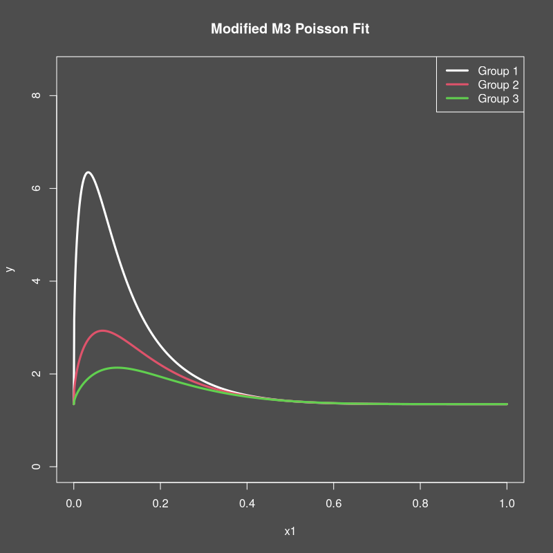

```{r setup}
#| include: false
knitr::opts_chunk$set(
  collapse = TRUE,
  comment = "#>"
)
```

## Introduction
This vignette demonstrates how to use the `mixedcurve` package to fit a
generalized Nadaraya-Watson kernel regression model to one-dimensional Poisson
data.

## Example Usage
Let's start by simulating some functional Poisson data with group effects to
fit a generalized Nadaraya-Watson kernel regression model to. We will make some
modifications to the Cuevas et al. m3 curve for this purpose.

<!-- {{{ Simulate data -->

```{R}

# Simulate some quadratic Poisson data with group-specific curves
set.seed(123)
# 1. Define the true curves
tf <- function(t, i) {
  # Define the rate function for Poisson data at time t
  exp(3 * exp(mixedcurve::m3(t, i)) - 2.7)
}
n <- 2000
set.seed(123)
fundata1 <- mixedcurve::gen_fanova_data(
  f = tf,
  bounds = c(0, 1),
  n = 1, # Still sensitive to n?
  nx = n,
  balanced = TRUE,
  ngrp = 3,
  sigma = 0.020,
  family = "poisson"
)
df1 <- fundata1$df
# 3. Plot the data
png("gnw_1d_poisson_data.png", width = 800, height = 800, res = 100)
mixedcurve::dark_mode()
plot(df1$x1, df1$y,
  col = adjustcolor(df1$grp, 0.1),
  pch = 20, ylim = c(0, 8.5),
  ylab = "y", xlab = "x1",
  main = "Modified M3 Poisson Fit"
)
qsq <- seq(0.0, 1.0, length.out = 1000)
lines(qsq, tf(qsq, 1), col = 1, lwd = 3)
lines(qsq, tf(qsq, 2), col = 2, lwd = 3)
lines(qsq, tf(qsq, 3), col = 3, lwd = 3)
legend("topright",
  legend = c("Group 1", "Group 2", "Group 3"), lty = 1, lwd = 3, 
  col = c( adjustcolor(1, 1.00), adjustcolor(2, 1.00), adjustcolor(3, 1.00))
)
invisible(dev.off())

#
```

<!-- }}} Simulate data -->

{width=95%}

Now, we can fit the generalized Nadaraya-Watson kernel regression model using
the `lpk` function from the `mixedcurve` package. We will specify the
bandwidth, kernel type, degree, and use the formula `y ~ K_h(x1 | grp)` to
indicate that we want to fit separate curves for each group.

<!-- {{{ Fit GNW model -->
```{r, message=FALSE, warning=FALSE}
# 4. Fit GNW kernel regression model (in parallel)
qseq <- matrix(seq(0.0, 1.0, length.out = 200), ncol = 1)
glpk1 <- mixedcurve::glpk(y ~ K_h(x1 | grp),
  queries = qseq,
  data = df1,
  degree = 0,
  kernel = mixedcurve::gauss_kern,
  family = "poisson",
  h = 0.015,
  parallel = TRUE
)
coefmat <- matrix(
  unlist(lapply(glpk1[[1]], function(elmt) { elmt$coef })), ncol = 3, byrow = TRUE
)
# 5. Plot the results
png("gnw_1d_poisson_fit.png", width = 800, height = 800, res = 100)
mixedcurve::dark_mode()
plot(df1$x1, df1$y,
  col = adjustcolor(df1$grp, 0.1),
  pch = 20, ylim = c(0, 8.5),
  ylab = "y", xlab = "x1",
  main = "Modified M3 Poisson data"
)
lines(qseq, tf(qseq, 1), col = 1)
lines(qseq, tf(qseq, 2), col = 2)
lines(qseq, tf(qseq, 3), col = 3)
lines(qseq, exp(coefmat[, 1]), col = 1, lwd = 2, lty = 2)
lines(qseq, exp(coefmat[, 1] + coefmat[, 2]), col = 2, lwd = 2, lty = 2)
lines(qseq, exp(coefmat[, 1] + coefmat[, 3]), col = 3, lwd = 2, lty = 2)
legend("topright",
  legend = c("Group 1", "Group 2", "Group 3", "True curves", "Estimates"),
  col = c(adjustcolor(1, 0.90), adjustcolor(2, 0.90), adjustcolor(3, 0.90), "white", "white"),
  lty = c(NA, NA, NA, 1, 2),
  pch = c(20, 20, 20, NA, NA),
  lwd = 2
)
invisible(dev.off())

#
```

<!-- }}} Fit GNW model -->

{width=95%}


#### TODO: add WY adjusted test
