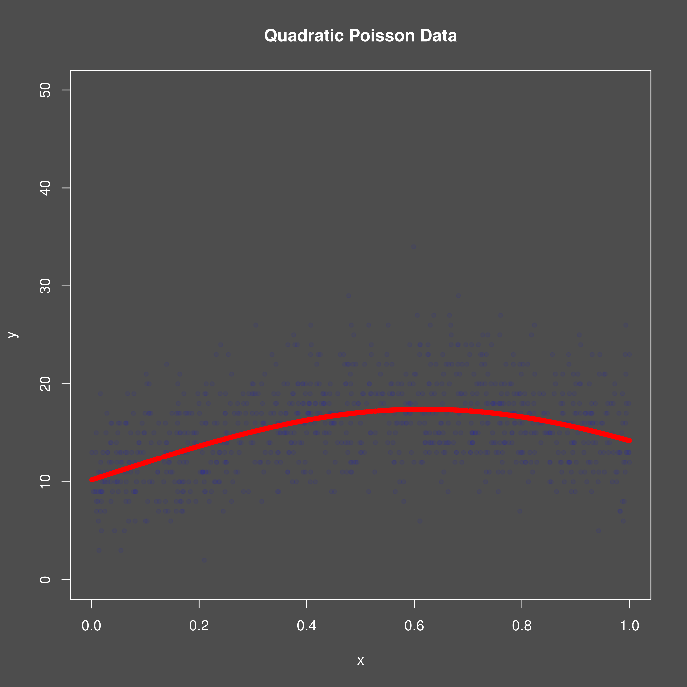
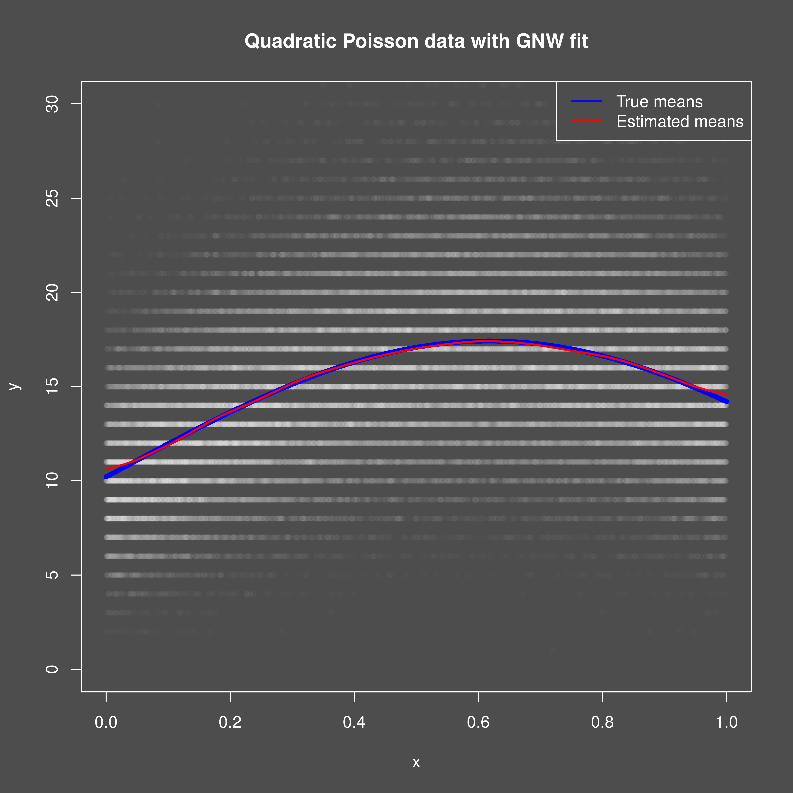

```{r setup}
#| include: false
knitr::opts_chunk$set(
  collapse = TRUE,
  comment = "#>"
)
```

## Introduction
This vignette demonstrates how to use the `mixedcurve` package to fit a
generalized Nadaraya-Watson kernel regression model to one-dimensional Poisson
data.

## Example Usage
Let's start by simulating some functional Poisson data with group effects to
fit a generalized Nadaraya-Watson kernel regression model to. We will make some
modifications to the Cuevas et al. m3 curve for this purpose.

<!-- {{{ Simulate data -->

```{R}
set.seed(300)
n <- 1000
x <- runif(n)
xmat <- cbind(rep(1, n), x, x^2)
betas_true <- c(2.323, 1.73, -1.4)
eta_true <- as.vector(xmat %*% betas_true)
y <- rpois(n, exp(eta_true))
df1 <- data.frame(y = y, x = x)

# 3. Plot the data
# png("vignettes/gnw_1d/gnw_1d_poisson_data.png", width = 4800, height = 4800, res = 600)
png("gnw_1d_poisson_data.png", width = 4800, height = 4800, res = 600)
mixedcurve::dark_mode()
plot(df1$x, df1$y,
  col = adjustcolor("blue", 0.05),
  pch = 20, ylim = c(0, 50.0),
  ylab = "y", xlab = "x",
  main = "Quadratic Poisson Data"
)
points(df1$x, exp(eta_true),
  col = adjustcolor("red", 1.00),
  pch = 20
)
invisible(dev.off())

#
```

<!-- }}} Simulate data -->

{width=95%}

Now, we can fit the generalized Nadaraya-Watson kernel regression model using
the `lpk` function from the `mixedcurve` package. We will specify the
bandwidth, kernel type, degree, and use the formula `y ~ K_h(x)` to
indicate that we want to fit a generalized local polynomial kernel model across
domain `x`.

<!-- {{{ Fit GNW model -->
```{r, message=FALSE, warning=FALSE}
# 4. Fit GNW kernel regression model (in parallel)
qseq <- seq(0.0, 1.0, length.out = 200)
glpk1 <- mixedcurve::glpk(y ~ K_h(x),
  queries = qseq,
  data = df1,
  degree = 0,
  kernel = mixedcurve::gauss_kern,
  h = 0.02,
  parallel = TRUE
)

# Extract the fitted curve
qrs <- unlist(lapply(glpk1[[1]], function(elmt) { elmt$coefs }))

# 5. Plot the results
# png("vignettes/gnw_1d/gnw_1d_poisson_fit.png",
#     width = 4800, height = 4800, res = 600)
png("gnw_1d_poisson_fit.png", width = 4800, height = 4800, res = 600)
mixedcurve::dark_mode()
plot(df1$x, df1$y,
  col = adjustcolor("white", 0.01),
  pch = 20, ylim = c(0, 30),
  ylab = "y", xlab = "x",
  main = "Quadratic Poisson data with GNW fit"
)
points(df1$x, exp(eta_true), col = adjustcolor("blue", 1.00), cex = 0.5)
lines(qseq, qrs, col = adjustcolor("red", 1.00), lwd = 2)
legend("topright",
  legend = c("True means", "Estimated means"),
  col = c(adjustcolor("blue", 0.90),
          adjustcolor("red", 0.90)),
  lty = c(1, 1),
  lwd = 2
)
invisible(dev.off())

#
```

<!-- }}} Fit GNW model -->

{width=95%}


#### TODO: add WY adjusted test
