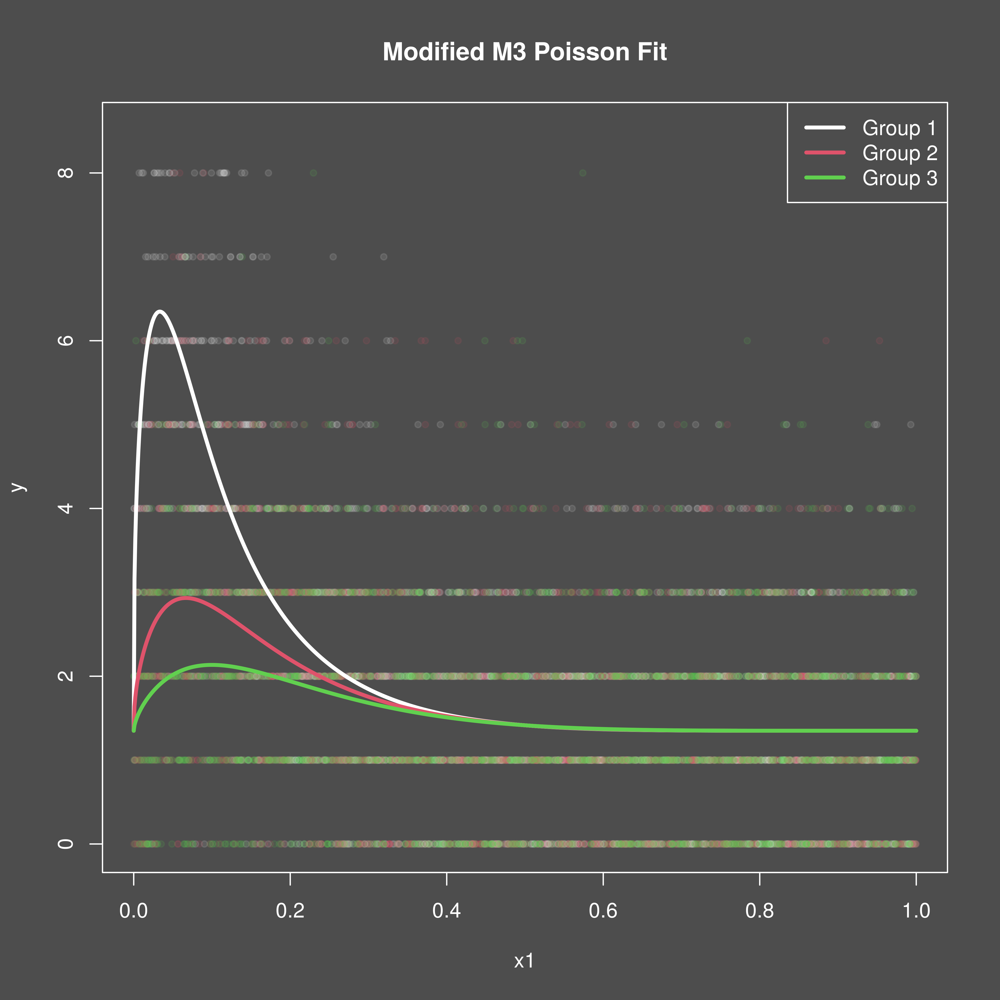
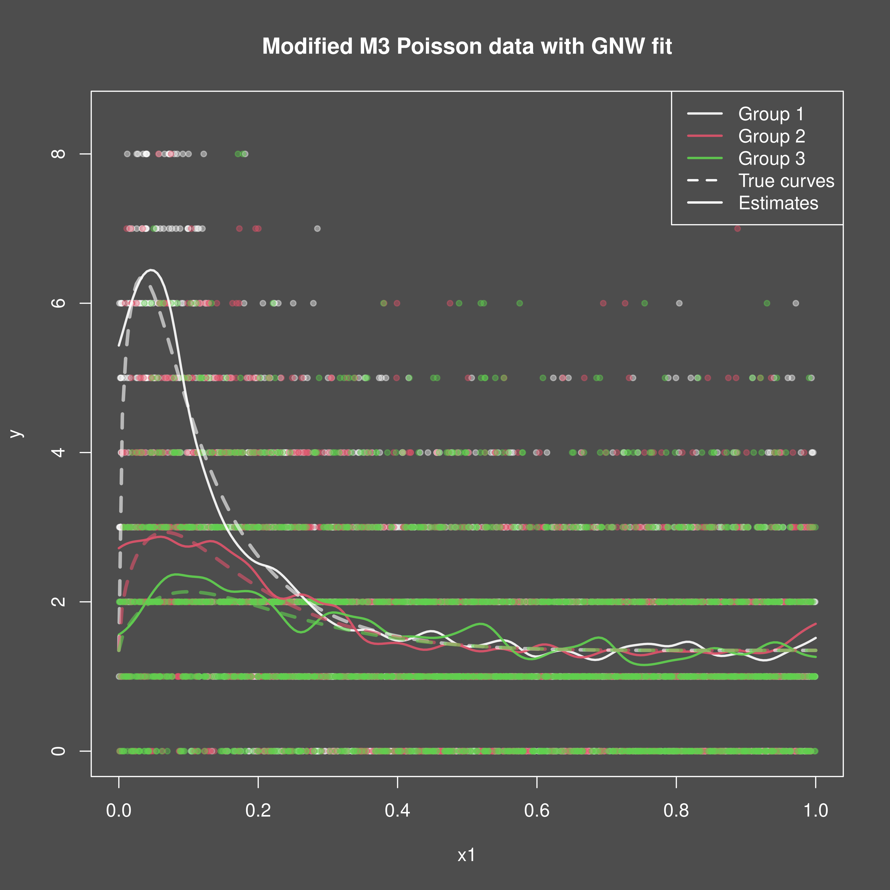

```{r setup}
#| include: false
knitr::opts_chunk$set(
  collapse = TRUE,
  comment = "#>"
)
```

## Introduction
This vignette demonstrates how to use the `mixedcurve` package to fit a
generalized Nadaraya-Watson kernel regression model to one-dimensional Poisson
data.

## Example Usage
Let's start by simulating some functional Poisson data with group effects to
fit a generalized Nadaraya-Watson kernel regression model to. We will make some
modifications to the Cuevas et al. m3 curve for this purpose.

```{R}

set.seed(1234)

# 1. Define the true curves
tf <- function(t, i) {
  # Define the rate function for Poisson data at time t
  exp(3 * exp(mixedcurve::m3(t, i)) - 2.7)
}

# 2. Generate the data
# TODO: don't make it curve data...
n <- 2000
fundata1 <- mixedcurve::gen_fanova_data(
  f = tf,
  bounds = c(0, 1),
  n = 1, # Still sensitive to n?
  nx = n,
  balanced = TRUE,
  ngrp = 3,
  sigma = 0.015,
  family = "poisson"
)
df1 <- fundata1$df

# 3. Plot the data
png("gnw_1d_poisson_data.png", width = 4800, height = 4800, res = 600)
mixedcurve::dark_mode()
plot(df1$x1, df1$y,
  col = adjustcolor(df1$grp, 0.40),
  pch = 20, ylim = c(0, 8.5),
  ylab = "y", xlab = "x1",
  main = "Modified M3 Poisson data"
)
invisible(dev.off())

#
```

{width=95%}

Now, we can fit the generalized Nadaraya-Watson kernel regression model using
the `lpk` function from the `mixedcurve` package. We will specify the
bandwidth, kernel type, degree, and use the formula `y ~ K_h(x1 | grp)` to
indicate that we want to fit separate curves for each group.

```{r, message=FALSE, warning=FALSE}
# 4. Fit GNW kernel regression model (in parallel)

# NOTE: Use normal distribution for now...
lpk1 <- mixedcurve::lpk(y ~ K_h(x1 | grp),
  seq(0.0, 1.0, length.out = 200),
  df1,
  degree = 0,
  kernel = mixedcurve::gauss_kern,
  h = 0.02,
  parallel = TRUE
)
# NOTE: Seems to fairly well - Estimates of variability are likely off?
qrs <- mixedcurve::get_queries(lpk1)
# 5. Plot the results
png("gnw_1d_poisson_fit.png", width = 4800, height = 4800, res = 600)
mixedcurve::dark_mode()
plot(df1$x1, df1$y,
  col = adjustcolor(df1$grp, 0.40),
  pch = 20, ylim = c(0, 8.5),
  ylab = "y", xlab = "x1",
  main = "Modified M3 Poisson data with GNW fit"
)
for (i in 1:3) {
  lines(seq(0.0, 1.0, length.out = 200), qrs[, i],
    col = adjustcolor(i, 0.90),
    lwd = 2
  )
}
for (i in 1:3) {
  lines(seq(0.0, 1.0, length.out = 200), tf(seq(0.0, 1.0, length.out = 200), i),
    col = adjustcolor(i, 0.60),
    lwd = 3, lty = 2
  )
}
legend("topright",
  legend = c("Group 1", "Group 2", "Group 3", "True curves", "Estimates"),
  col = c(adjustcolor(1, 0.90), adjustcolor(2, 0.90), adjustcolor(3, 0.90), "white", "white"),
  lty = c(1, 1, 1, 2, 1),
  lwd = 2
)
invisible(dev.off())
```

{width=95%}
