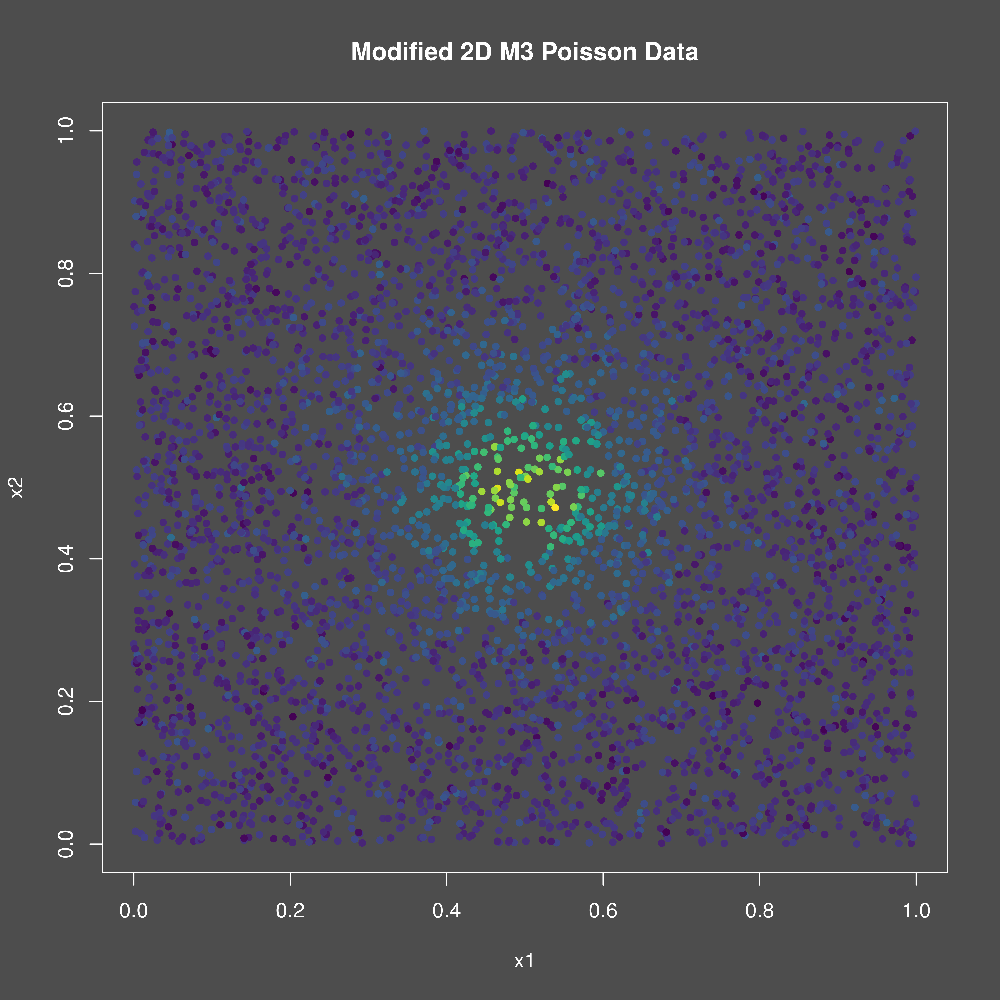
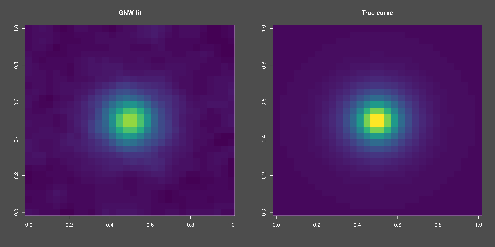

<!-- {{{ Setup -->
```{r setup}
#| include: false
knitr::opts_chunk$set(
  collapse = TRUE,
  comment = "#>"
)
```
<!-- }}} Setup -->

## Introduction
This vignette demonstrates how to use the `mixedcurve` package to fit a
generalized Nadaraya-Watson kernel regression model to two-dimensional Poisson
data.

## Example Usage
Let's start by simulating some functional Poisson data with group effects to
fit a generalized Nadaraya-Watson kernel regression model to. We will make some
modifications to the Cuevas et al. m3 curve for this purpose.

<!-- {{{ Simulate data -->
```{r}

set.seed(123)
# 1. Define the true curves
tf <- function(t, i) {
  # Define the rate function for Poisson data at time t
    exp(3 * exp(mixedcurve::m3(t, i)))
}
n <- 5000
set.seed(123)
fundata1 <- mixedcurve::gen_fanova_data(
  f = tf,
  bounds = list(c(0, 1),
                c(0, 1)),
  px = runif,
  pxargs = list(list(min = 0, max = 1),
                list(min = 0, max = 1)),
  n = 1,
  nx = n,
  balanced = TRUE,
  systematic = FALSE,
  ngrp = 1,
  sigma = 3.020,
  family = "poisson"
)
df1 <- fundata1$df
color_values <- cut(df1$y, breaks = 100, labels = FALSE)
color_scale <- viridis::viridis(100)
png("./gnw_2d_poisson_data.png", width = 4800, height = 4800, res = 600)
mixedcurve::dark_mode()
plot(df1$x1, df1$x2,
  col = color_scale[color_values],
  pch = 20,
  xlab = "x1", ylab = "x2",
  main = "Modified 2D M3 Poisson Data"
)
invisible(dev.off())

#
```

<!-- }}} Simulate data -->

{width=95%}

Now, we can fit the generalized Nadaraya-Watson kernel regression model using
the `lpk` function from the `mixedcurve` package. We will specify the
bandwidth, kernel type, degree, and use the formula `y ~ K_h(x * y)` to
indicate that we want to fit a generalized local polynomial kernel model across
domain `x * y`, i.e. the two-dimensional plane.


<!-- {{{ Fit GNW model -->
```{r, message=FALSE, warning=FALSE}

# 4. Fit GNW kernel regression model (in parallel)
nxy <- 30
glpk1 <- mixedcurve::glpk(y ~ K_h(x1 * x2),
  queries = as.matrix(expand.grid(
    seq(0.0, 1.0, length.out = nxy),
    seq(0.0, 1.0, length.out = nxy)
  )),
  data = df1,
  degree = 0,
  kernel = mixedcurve::gauss_kern,
  family = "poisson",
  h = c(0.02),
  parallel = TRUE
)
qs <- matrix(
  unlist(lapply(glpk1[[1]], function(elmt) { exp(elmt$coefs) })), nxy, nxy, byrow = TRUE
)
all_values <- c(
                qs, tf(expand.grid(
  seq(0.0, 1.0, length.out = nxy),
  seq(0.0, 1.0, length.out = nxy)
), 1))
breaks <- seq(min(all_values), max(all_values), length.out = 101)
colors <- viridis::viridis(100)
png("./gnw_2d_poisson_fit.png", width = 9600, height = 4800, res = 600)
par(mfrow = c(1, 2))
mixedcurve::dark_mode()
image(matrix(unlist(lapply(glpk1[[1]], function(elmt) { exp(elmt$coefs) })), nxy, nxy, byrow = TRUE),
  col = colors, breaks = breaks,
  main = "GNW fit"
)
image(matrix(tf(expand.grid(
  seq(0.0, 1.0, length.out = nxy),
  seq(0.0, 1.0, length.out = nxy)
), 1), nxy, nxy),
  col = colors, breaks = breaks,
  main = "True curve"
)
dev.off()

#
```

<!-- }}} Fit GNW model -->

{width=95%}


