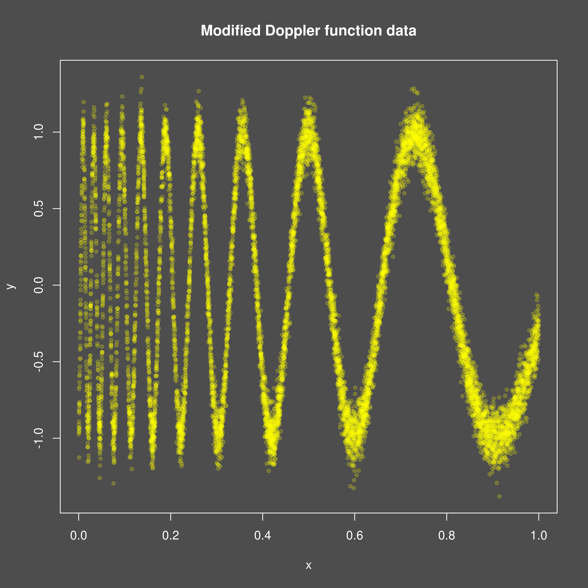
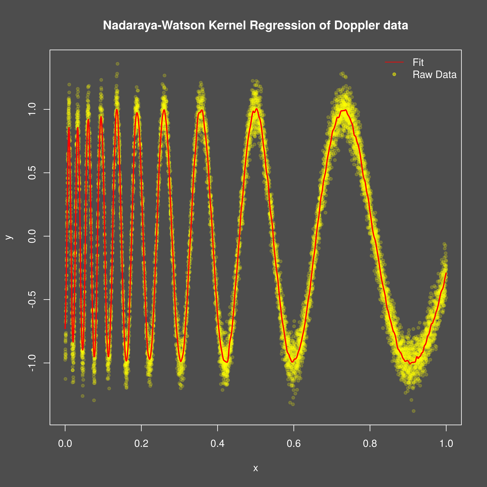

```{r setup}
#| include: false
knitr::opts_chunk$set(
  collapse = TRUE,
  comment = "#>"
)
```

## Introduction
This vignette demonstrates how to use the `mixedcurve` package to fit a
Nadaraya-Watson kernel regression model to one-dimensional data.

## Example Usage
Let's start by simulating some data according to a modified version of the
doppler function to fit a Nadaraya-Watson curve kernel regression model to.

```{r, fig.width=7, fig.height=5, dpi=600, out.width="700px", message=FALSE, warning=FALSE}
library(mixedcurve)

# Simulate
set.seed(123)
mdoppler <- function(x) {
  sin(20 / (x + 0.25))
}
n <- 10000
x <- runif(n, 0, 1)
y <- mdoppler(x) + rnorm(n, sd = 0.1)
png("doppler_data.png", width = 4800, height = 4800, res = 600)
mixedcurve::dark_mode()
plot(x, y, main = "Modified Doppler function data",
     pch = 20, col = adjustcolor("yellow", 0.2))
invisible(dev.off())

```

{width=95%}

To fit the Nadaraya-Watson kernel regression model, we can use the `lpk`
function from the `mixedcurve` package. We will specify the bandwidth, kernel
type, and degree.
 
```{r, message=FALSE, warning=FALSE}
# Fit Nadaraya-Watson kernel regression model (in parallel)

df1 <- data.frame(x = x, y = y)
bandwidth <- 0.002
queries <- seq(0, 1, length.out = 1000)
cl = parallel::makeCluster(parallel::detectCores() - 1)
invisible(parallel::clusterEvalQ(cl, library(mixedcurve)))
parallel::clusterExport(cl, varlist = c("df1", "bandwidth", "queries"))
nw_fit <- mixedcurve::lpk(y ~ K_h(x), h = bandwidth,
                          kernel = mixedcurve::gauss_kern, degree = 0,
                          data = df1, queries = queries,
                          parallel = TRUE, cl = cl)
parallel::stopCluster(cl)
fits <- mixedcurve::get_queries(nw_fit)


png("doppler_data_fit.png", width = 4800, height = 4800, res = 600)
mixedcurve::dark_mode()
plot(x, y, main = "Nadaraya-Watson Kernel Regression of Doppler data",
     pch = 20, col = adjustcolor("yellow", 0.2), cex = 1.0)
lines(queries, fits, col = adjustcolor("red", 1.0), lwd = 2)
legend("topright", legend = c("Fit", "Raw Data"),
lty = c(1, NA), pch = c(NA, 20), col = c("red", adjustcolor("yellow", 0.5)), bty = "n")
invisible(dev.off())

#
```

{width=95%}
