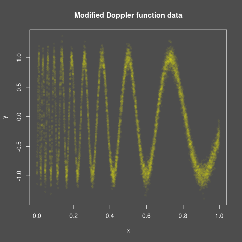

```{r setup}
#| include: false
knitr::opts_chunk$set(
  collapse = TRUE,
  comment = "#>"
)
```

## Introduction
This vignette demonstrates how to use the `mixedcurve` package to fit a
Nadaraya-Watson kernel regression model to one-dimensional data.

## Example Usage
Let's start by simulating some data according to a modified version of the
doppler function to fit a Nadaraya-Watson curve kernel regression model to.

```{r, fig.width=7, fig.height=5, dpi=600, out.width="700px"}
library(mixedcurve)

# Simulate
set.seed(123)
mdoppler <- function(x) {
  sin(20 / (x + 0.25))
}
n <- 10000
x <- runif(n, 0, 1)
y <- mdoppler(x) + rnorm(n, sd = 0.1)
png("vignettes/nw_1d_vignette/doppler_data.png")
mixedcurve::dark_mode()
plot(x, y, main = "Modified Doppler function data", pch = 20, col = adjustcolor("yellow", 0.03))
dev.off()

```

[

To fit the Nadaraya-Watson kernel regression model, we can use the `lpk`
function from the `mixedcurve` package. We will specify the bandwidth, kernel
type, and degree.
 
```{r}
# Fit Nadaraya-Watson kernel regression model
df1 <- data.frame(x = x, y = y)
bandwidth <- 0.05
queries <- seq(0, 1, length.out = 100)
cl = parallel::makeCluster(parallel::detectCores() - 1)
nw_fit <- mixedcurve::lpk(y ~ K_h(x), h = bandwidth, kernel = mixedcurve::gauss_kern, degree = 0, data = df1, queries = queries, cl = cl)
parallel::stopCluster(cl)
```


