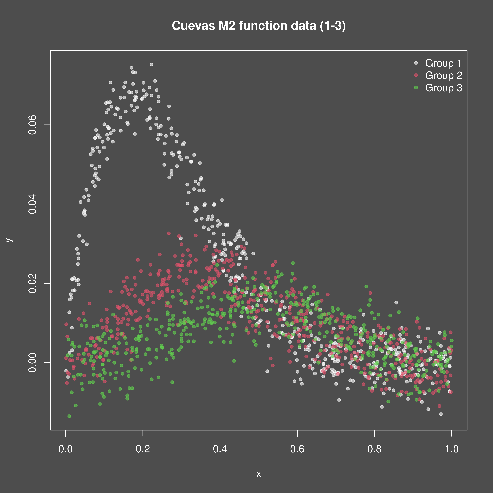
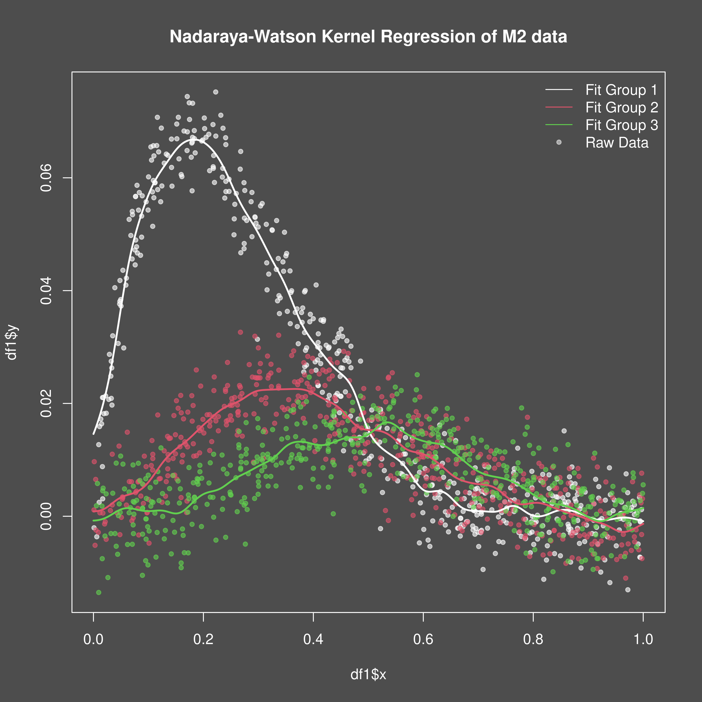

<!-- {{{ Setup  -->

```{r setup}
#| include: false
knitr::opts_chunk$set(
  collapse = TRUE,
  comment = "#>"
)
```

<!-- }}} Setup  -->

## Introduction
This vignette demonstrates how to use the `mixedcurve` package to fit a
Nadaraya-Watson kernel regression model to one-dimensional data with a single
covariate.

## Example Usage
Let's start by simulating some data according to the m3 Cuevas et al. function:

<!-- {{{ Generate data -->

```{r, fig.width=7, fig.height=5, dpi=600, out.width="700px", message=FALSE, warning=FALSE}
library(mixedcurve)

n <- 500
fundata1 <- mixedcurve::gen_fanova_data(
  f = mixedcurve::m2, bounds = c(0, 1),
  n = 1, ngrp = 3, nx = n,
  balanced = TRUE, pgrp = sample,
  pgrpargs = list(x = 1:3, size = 50, replace = TRUE),
  sigma = 0.005, systematic = FALSE, px = runif,
  pxargs = list(min = 0, max = 1),
  white_noise = TRUE, cov_scale = 0.05, gpn = 1000
)
df1 <- fundata1$df
# png("vignettes/nw_1d_w_covariate/m2_data.png", width = 4800, height = 4800, res = 600)
png("m2_data.png", width = 4800, height = 4800, res = 600)
mixedcurve::dark_mode()
plot(df1$x1, df1$y, main = "Cuevas M2 function data (1-3)",
     ylab = "y", xlab = "x", pch = 20, col = adjustcolor(df1$grp, 0.6))
legend("topright", legend = c("Group 1", "Group 2", "Group 3"),
       pch = 20, col = adjustcolor(1:3, 0.6), bty = "n")
invisible(dev.off())

```

<!-- }}} Generate data -->

[{width=95%}

To fit the Nadaraya-Watson kernel regression model, we can use the `lpk`
function from the `mixedcurve` package. We will specify the bandwidth, kernel
type, and degree.
 
<!-- {{{ Fit NW model -->

```{r, message=FALSE, warning=FALSE}
# Fit Nadaraya-Watson kernel regression model (in parallel)

bandwidth <- 0.02
queries <- seq(0, 1, length.out = 1000)
cl = parallel::makeCluster(parallel::detectCores() - 1)
invisible(parallel::clusterEvalQ(cl, library(mixedcurve)))
parallel::clusterExport(cl, varlist = c("df1", "bandwidth", "queries"))
nw_fit <- mixedcurve::lpk(y ~ K_h(x1 | grp), h = bandwidth,
                          kernel = mixedcurve::gauss_kern, degree = 0,
                          data = df1, queries = queries,
                          parallel = TRUE, cl = cl)
parallel::stopCluster(cl)

# Extract the fits
coefs <- matrix(unlist(lapply(nw_fit[[1]], function (fit) fit$coefs)), ncol = 3, byrow = TRUE)
fits <- cbind(coefs[, 1], coefs[, 1] + coefs[, 2], coefs[, 1] + coefs[, 3])

# png("./vignettes/nw_1d_w_covariate/m2_data_fit.png", width = 4800, height = 4800, res = 600)
png("m2_data_fit.png", width = 4800, height = 4800, res = 600)
mixedcurve::dark_mode()
plot(df1$x, df1$y, main = "Nadaraya-Watson Kernel Regression of M2 data",
     pch = 20, col = adjustcolor(df1$grp, 0.6), cex = 1.0,
     xlab = "x", ylab = "y")
for (i in 1:3) {
  lines(queries, fits[, i], col = adjustcolor(i, 1.0), lwd = 2)
}
legend("topright", legend = c("Fit Group 1", "Fit Group 2", "Fit Group 3", "Raw Data"),
         lty = c(1, 1, 1, NA), pch = c(NA, NA, NA, 20),
         col = c(adjustcolor(1, 1.0), adjustcolor(2, 1.0), adjustcolor(3, 1.0),
                adjustcolor("white", 0.5)), bty = "n")
invisible(dev.off())

#
```

<!-- }}} Fit NW model -->

[{width=95%}


#### TODO: add WY adjusted test
