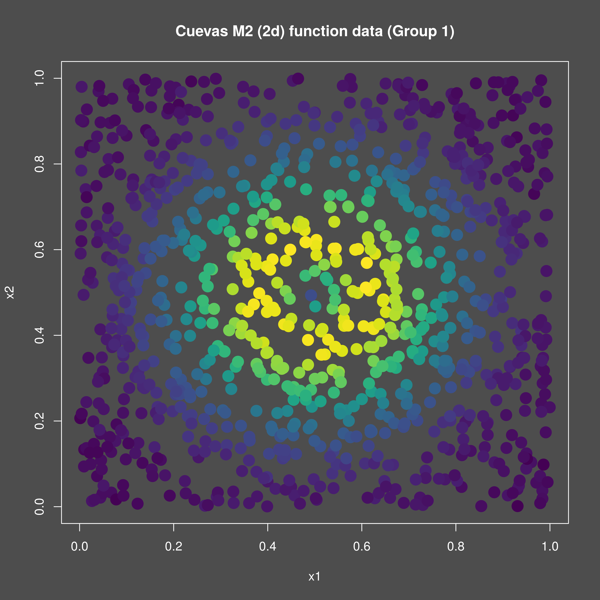

<!-- {{{ Setup -->
```{r setup}
#| include: false
knitr::opts_chunk$set(
  collapse = TRUE,
  comment = "#>"
)
```
<!-- }}} Setup -->

## Introduction
This vignette demonstrates how to use the `mixedcurve` package to fit a
Nadaraya-Watson kernel regression model to two-dimensional data.

## Example Usage
Let's start by simulating some data according to the m2 Cuevas et al. function
modified to two dimensions:

<!-- {{{ Generate data -->
```{r, fig.width=7, fig.height=5, dpi=600, out.width="700px", message=FALSE, warning=FALSE}

library(mixedcurve)

nxy <- 1000
fundata1 <- mixedcurve::gen_fanova_data(
  f = mixedcurve::m2, bounds = list(c(0, 1), c(0, 1)),
  n = 1, ngrp = 1, nx = nxy, balanced = TRUE,
  systematic = FALSE, sigma = 0.001, px = runif,
  pxargs = list(
    list(min = 0, max = 1),
    list(min = 0, max = 1)
  ), white_noise = TRUE
)
df1 <- fundata1$df
# png("./vignettes/nw_2d/m2_data.png", width = 4800, height = 4800, res = 600)
png("m2_data.png", width = 4800, height = 4800, res = 600)
mixedcurve::dark_mode()
color_scale <- viridis::viridis(100)
color_values <- cut(df1$y, breaks = 100, labels = FALSE)
par(mfrow = c(1, 1))
plot(df1$x1, df1$x2,
     col = color_scale[color_values],
     pch = 20, xlab = "x1", ylab = "x2",
     main = "Cuevas M2 (2d) function data (Group 1)", cex = 3.0)
invisible(dev.off())

#
```      
<!-- }}} Generate data -->

{width=95%}

To fit the Nadaraya-Watson kernel regression model, we can use the `lpk`
function from the `mixedcurve` package. We will specify the bandwidth, kernel
type, and degree and the function `y ~ K_h(x1 * x2)` to indicate a two-dimensional
kernel regression on the 2d (product) space of `x1 * x2`.

<!-- {{{ Fit NW model -->
```{r, message=FALSE, warning=FALSE}

# Fit Nadaraya-Watson kernel regression model (in parallel)
nq <- 20
qseq <- as.matrix(expand.grid(
  seq(0.0, 1.0, length.out = nq),
  seq(0.0, 1.0, length.out = nq))
)
lpk2 <- mixedcurve::lpk(y ~ K_h(x1 * x2),
  queries = qseq,
  data = df1, degree = 0, kernel = mixedcurve::gauss_kern,
  h = 0.01, parallel = TRUE
)
fits <- as.numeric(unlist(lapply(lpk2[[1]], function (fit) fit$coefs)))
all_values <- c(fits, mixedcurve::m2(qseq, 1))
breaks <- seq(min(all_values), max(all_values), length.out = 101)
colors <- viridis::viridis(100)
# png("./vignettes/nw_2d/m2_data_fit.png", width = 3 * 4800, height = 4800, res = 600)
png("m2_data_fit.png", width = 3 * 4800, height = 4800, res = 600)
mixedcurve::dark_mode()
par(mfrow = c(1, 2))
image(matrix(mixedcurve::m2(qseq, 1), nq, nq),
  col = colors, breaks = breaks,
  axes = FALSE, main = "Cuevas M2 True Function (Group 1)"
)
image(matrix(fits, nq, nq),
  col = colors, breaks = breaks,
  axes = FALSE, main = paste("Nadaraya-Watson Fit Cuevas M2 (Group 1)")
)
invisible(dev.off())

#
```
<!-- }}} Fit NW model -->

{width=95%}


#### TODO: add WY adjusted test
